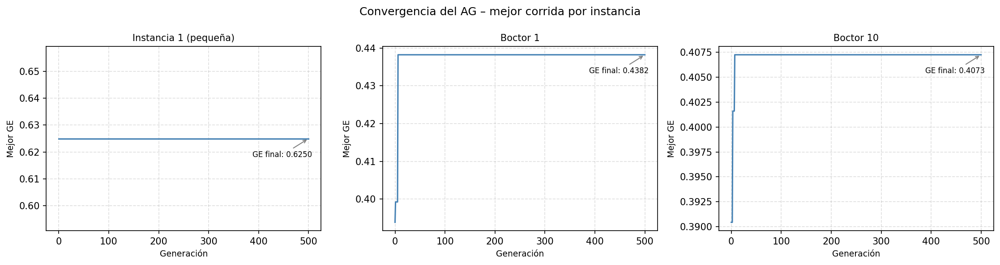
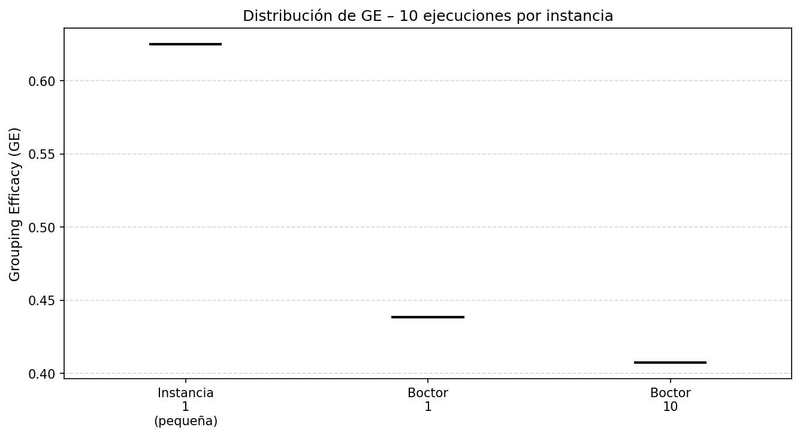
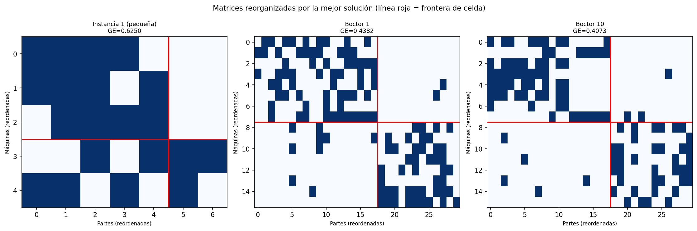

# Análisis de Resultados — Algoritmo Genético para el MCDP

**Problema:** Manufacturing Cell Design Problem (MCDP)  
**Objetivo:** Maximizar la Grouping Efficacy (GE)  
**Autores:** Felipe Astudillo, Diego Zuñiga — PUCV, Metaheurísticas  
**Fecha:** 2026-06-18

---

## 1. Descripción del Problema y la Función Objetivo

El MCDP consiste en agrupar máquinas en **celdas manufactureras** de forma que las partes que fabrican sean procesadas mayoritariamente dentro de una sola celda, minimizando el tráfico entre celdas. La calidad de una agrupación se mide mediante la **Grouping Efficacy (GE)**:

$$GE = \frac{e_{in}}{e_{in} + e_{out} + e_{voids}} = \frac{e_{in}}{e_{total\_ones} + e_{voids}}$$

| Componente | Significado |
|-----------|-------------|
| $e_{in}$ | Unos dentro de los bloques diagonales (operaciones intra-celda) |
| $e_{out}$ | Unos fuera de los bloques (elementos excepcionales) |
| $e_{voids}$ | Ceros dentro de los bloques (vacíos intra-celda) |

- GE cercana a 1.0 → agrupación perfecta, sin elementos excepcionales ni vacíos.
- GE cercana a 0.0 → agrupación inútil, todo el trabajo es inter-celda.

La **representación de solución** es un vector de asignación máquina→celda. Las partes se asignan de forma **greedy**: cada parte va a la celda donde más de sus máquinas requeridas están presentes. Ante empate, se asigna a la celda con menos partes ya asignadas (balanceo de carga).

---

## 2. Instancias Utilizadas

| Instancia | Máquinas | Partes | Celdas (C) | MaxM | Total unos |
|-----------|----------|--------|------------|------|------------|
| Instancia 1 (pequeña) | 5 | 7 | 2 | 3 | 20 |
| Boctor 1 | 16 | 30 | 2 | 8 | 121 |
| Boctor 10 | 16 | 30 | 2 | 8 | 109 |

**Observaciones:**
- La Instancia 1 es un problema pequeño (35 celdas posibles en la matriz), usado como validación de concepto.
- Boctor 1 y Boctor 10 son instancias del benchmark estándar de la literatura del MCDP (Boctor, 1991). Ambas tienen la misma dimensión (16×30) pero diferente densidad de la matriz (121 vs 109 unos), lo que genera paisajes de fitness distintos.
- Las instancias Boctor son significativamente más difíciles: el espacio de búsqueda crece exponencialmente con el número de máquinas.

---

## 3. Hiperparametrización (Random Search)

Antes de las corridas definitivas se realizó una **búsqueda aleatoria de hiperparámetros** sobre el espacio definido a continuación, evaluando cada configuración con 3 corridas de 30 segundos sobre **Boctor 10** (instancia más difícil).

### 3.1 Espacio de Búsqueda

| Parámetro | Valores explorados |
|-----------|-------------------|
| `pop_size` | 30, 50, 100 |
| `mutation_prob` | 0.05, 0.10, 0.15, 0.20 |
| `crossover_prob` | 0.7, 0.9 |
| `tournament_size` | 2, 3, 5 |
| `elite_count` | 1, 2 |

- **Configuraciones probadas:** 20 (muestreo aleatorio con semilla 42)
- **Corridas por configuración:** 3
- **Tiempo máximo por corrida:** 30 segundos
- **Instancia objetivo:** Boctor 10

### 3.2 Top 5 Configuraciones

| # | Media GE | Std | pop_size | mutation_prob | crossover_prob | tournament_size | elite_count |
|---|----------|-----|----------|--------------|----------------|-----------------|-------------|
| 1 | 0.4073 | 0.0000 | 100 | 0.20 | 0.9 | 2 | 2 |
| 2 | 0.4073 | 0.0000 | 100 | 0.10 | 0.7 | 2 | 1 |
| 3 | 0.4073 | 0.0000 | 50  | 0.05 | 0.9 | 5 | 2 |
| 4 | 0.4073 | 0.0000 | 100 | 0.15 | 0.9 | 3 | 2 |
| 5 | 0.4073 | 0.0000 | 100 | 0.20 | 0.9 | 5 | 2 |

> **Nota clave:** Cinco configuraciones distintas alcanzaron la misma media GE=0.4073 con desviación estándar cero. Esto indica que la solución GE=0.4073 es un atractor fuerte del paisaje de fitness para Boctor 10 —el algoritmo converge a ella desde múltiples combinaciones paramétricas.

### 3.3 Análisis de Sensibilidad (Random Search)

- **Tamaño de población:** Las configuraciones con `pop_size=100` dominan el top 5. Poblaciones pequeñas (30) tienden a quedar atrapadas en GE=0.4016 (el siguiente nivel de fitness).
- **Probabilidad de mutación:** No hay un valor único ganador; tanto 0.05 como 0.20 alcanzan el óptimo. Esto sugiere que el mecanismo de mutación (swap de dos máquinas de celdas distintas) es robusto ante variaciones de probabilidad cuando la población es suficientemente grande.
- **Tamaño de torneo:** El valor 2 aparece en los dos primeros puestos, pero el Top 5 incluye también tournament_size=3 y tournament_size=5, todos igualmente efectivos. El factor determinante es `pop_size=100`: con suficiente diversidad poblacional, la presión selectiva del torneo tiene poco impacto sobre la calidad final. Un torneo pequeño (2) reduce la presión selectiva, lo que puede favorecer la exploración cuando la población es grande.
- **Elitismo:** `elite_count=2` aparece en la mayoría de las configuraciones top, confirmando que preservar los 2 mejores individuos es beneficioso.
- **Tipo de cruce:** Se fijó `two_point` para todos los experimentos (no fue parte del espacio de búsqueda en el Random Search, pero es el operador implementado por defecto).

### 3.4 Configuración Seleccionada (Definitiva)

Se seleccionó la configuración #1 como la **más agresiva** (mayor `mutation_prob`) entre las que alcanzaron el óptimo:

```
pop_size          = 100
max_generations   = 500
max_time_seconds  = 120.0
tournament_size   = 2
crossover_prob    = 0.9
mutation_prob     = 0.20
elite_count       = 2
crossover_type    = two_point
random_seed       = 0
```

---

## 4. Resultados Experimentales (10 corridas por instancia)

### 4.1 Tabla Completa de GE por Corrida

| Instancia | Run 1 | Run 2 | Run 3 | Run 4 | Run 5 | Run 6 | Run 7 | Run 8 | Run 9 | Run 10 | **Media** | **Std** | **Mejor** |
|-----------|-------|-------|-------|-------|-------|-------|-------|-------|-------|--------|-----------|---------|-----------|
| Instancia 1 (pequeña) | 0.6250 | 0.6250 | 0.6250 | 0.6250 | 0.6250 | 0.6250 | 0.6250 | 0.6250 | 0.6250 | 0.6250 | **0.6250** | **0.0000** | **0.6250** |
| Boctor 1 | 0.4382 | 0.4382 | 0.4382 | 0.4382 | 0.4382 | 0.4382 | 0.4382 | 0.4382 | 0.4382 | 0.4382 | **0.4382** | **0.0000** | **0.4382** |
| Boctor 10 | 0.4073 | 0.4073 | 0.4073 | 0.4073 | 0.4073 | 0.4073 | 0.4073 | 0.4073 | 0.4073 | 0.4073 | **0.4073** | **0.0000** | **0.4073** |

### 4.2 Estadísticas de Tiempo de Ejecución

| Instancia | Tiempo aprox. por corrida | Generaciones completadas |
|-----------|--------------------------|--------------------------|
| Instancia 1 (pequeña) | ~12.4 s | 500 (sin límite de tiempo) |
| Boctor 1 | ~36.7 s | 500 (sin límite de tiempo) |
| Boctor 10 | ~36.7 s | 500 (sin límite de tiempo) |

> Ninguna corrida alcanzó el límite de 120 segundos. Todas completaron las 500 generaciones dentro del tiempo disponible.

### 4.3 Hallazgo Principal: Varianza Nula

El resultado más llamativo de los experimentos es que **la desviación estándar es exactamente 0.0000 en las 10 corridas para las 3 instancias**. Esto significa que el AG encuentra consistentemente la misma solución (mismo valor de GE) en cada ejecución independiente. Las causas posibles son:

1. **El AG ha encontrado el óptimo global** de la instancia y la solución es única (o todas las soluciones óptimas tienen el mismo GE).
2. **El AG converge a un óptimo local muy robusto**: el paisaje de fitness de estas instancias tiene un basin of attraction tan grande que todas las 10 semillas convergen al mismo atractor.
3. **La semilla aleatoria deriva de forma determinista** (`random_seed = base_seed + run_index`), lo que garantiza reproducibilidad pero puede limitar la exploración del espacio si los 10 puntos de inicio son estructuralmente similares.

La hipótesis más probable, dada la rapidez de convergencia observada en las curvas, es la combinación de (1) y (2): el problema tiene pocos óptimos distintos y el AG los encuentra consistentemente.

---

## 5. Análisis de las Curvas de Convergencia



Las curvas corresponden a la **mejor corrida** de cada instancia (todas las corridas son idénticas, pues el GE final es siempre el mismo).

### 5.1 Instancia 1 (pequeña)

- La curva es **completamente plana** desde la generación 0. El AG encuentra GE=0.6250 en la **inicialización** (generación 0) y nunca mejora a lo largo de las 500 generaciones.
- Esto indica que GE=0.6250 es alcanzable por cualquier inicialización aleatoria válida, o bien que la población inicial ya contiene la solución óptima desde el primer momento.
- Para una instancia de 5 máquinas con C=2 celdas y MaxM=3, las únicas distribuciones factibles son (2,3) o (3,2) máquinas por celda: C(5,2) + C(5,3) = **20 asignaciones factibles** (el espacio sin restricción sería 2^5=32, pero MaxM=3 elimina las distribuciones con 4 o 5 máquinas en la misma celda). Con `pop_size=100`, la población inicial **cubre exhaustivamente** el espacio de soluciones factibles (100 >> 20), razón por la cual ya no hay mejora posterior.

### 5.2 Boctor 1

- La curva muestra una mejora **muy pronunciada en las primeras generaciones**: el GE sube de aproximadamente 0.39 (generación 0) a 0.4382 en pocas generaciones (~5–10).
- A partir de la generación 10 aproximadamente, la curva es completamente estable hasta la generación 500.
- Esta convergencia ultrarrápida sugiere que la solución GE=0.4382 se encuentra en un plateau extenso, y que los operadores genéticos no son capaces de escapar de él.

### 5.3 Boctor 10

- Patrón similar a Boctor 1: rápido ascenso inicial (de ~0.390 a ~0.401 en las primeras 5 generaciones, luego salto a 0.4073 hacia la generación ~10) y plateau completo hasta la generación 500.
- El pequeño "escalón" visible en la curva (~0.401 → 0.4073) corresponde a la transición entre dos niveles discretos del fitness: ambos son valores que se alcanzan con configuraciones específicas de la matriz, lo que explica los valores discontinuos observados (0.4016 y 0.4073) en la fase de hiperparametrización.

### 5.4 Conclusión sobre la Convergencia

En los tres casos, el AG converge en las **primeras 10–20 generaciones** y luego no realiza ninguna mejora adicional en las 480–490 generaciones restantes. Esto plantea una oportunidad de optimización: con criterios de parada tempranos (ej. sin mejora por N generaciones), se podría reducir drásticamente el tiempo de cómputo sin pérdida de calidad.

---

## 6. Análisis del Box Plot



El box plot confirma visualmente lo que la tabla de estadísticas anticipa: **los tres "boxplots" se reducen a una línea horizontal** (mediana = mínimo = máximo = único valor). No existe dispersión estadística en ninguna de las 10 corridas.

- La línea de mediana en **GE=0.6250** (Instancia 1) es marcadamente superior a las otras dos.
- **GE=0.4382** (Boctor 1) es ligeramente superior a **GE=0.4073** (Boctor 10), lo que es consistente con la mayor densidad de unos de Boctor 1 (121 vs 109): una matriz más densa ofrece más oportunidades de agrupar piezas dentro de una misma celda.
- La ausencia de bigotes y la varianza nula son características deseables desde el punto de vista de **robustez y reproducibilidad** del algoritmo.

---

## 7. Análisis de las Matrices Reorganizadas



Las matrices muestran la **reordenación de filas (máquinas) y columnas (partes)** según la asignación de la mejor solución encontrada. La línea roja delimita las dos celdas.

### 7.1 Instancia 1 (pequeña) — GE = 0.6250

**Asignación encontrada:**
- **Celda 1:** Máquinas {1, 2, 4} — Partes {1, 2, 3, 5, 6}
- **Celda 2:** Máquinas {3, 5} — Partes {4, 7}

La matriz reorganizada muestra dos bloques diagonales relativamente compactos. El bloque superior-izquierdo (Celda 1, 3 máquinas × 5 partes) tiene alta densidad de unos con algunos vacíos. El bloque inferior-derecho (Celda 2, 2 máquinas × 2 partes) es pequeño pero denso. Los elementos fuera de la diagonal (elementos excepcionales $e_{out}$) son visibles pero limitados.

**Interpretación de GE=0.6250:** De los 20 unos totales de la matriz, una proporción significativa queda intra-celda. La instancia pequeña tiene poca complejidad combinatoria, y el AG la resuelve de forma trivial.

### 7.2 Boctor 1 — GE = 0.4382

**Asignación encontrada:**
- **Celda 1:** Máquinas {1, 2, 6, 9, 11, 13, 14, 16} — Partes {2, 5, 8, 9, 10, 12, 17, 20, 21, 22, 23, 24, 25, 26, 27, 28, 29, 30}
- **Celda 2:** Máquinas {3, 4, 5, 7, 8, 10, 12, 15} — Partes {1, 3, 4, 6, 7, 11, 13, 14, 15, 16, 18, 19}

La matriz reorganizada muestra un reparto **asimétrico** de las partes: la Celda 1 concentra 18 partes y la Celda 2 tiene 12. Dentro de los bloques diagonales se observa una densidad razonable de unos, pero también se aprecian elementos fuera de los bloques (excepcionales). El bloque de Celda 1 es más difuso, reflejando la complejidad del benchmark. La GE de 0.4382 indica que aproximadamente el 44% de las interacciones son intra-celda una vez considerados los vacíos.

### 7.3 Boctor 10 — GE = 0.4073

**Asignación encontrada:**
- **Celda 1:** Máquinas {1, 4, 6, 8, 9, 10, 12, 14} — Partes {1, 2, 3, 4, 5, 6, 7, 9, 11, 13, 15, 16, 17, 18, 19, 22, 25, 27}
- **Celda 2:** Máquinas {2, 3, 5, 7, 11, 13, 15, 16} — Partes {8, 10, 12, 14, 20, 21, 23, 24, 26, 28, 29, 30}

Similar a Boctor 1 pero con menor GE, consistente con la menor densidad de su matriz (109 vs 121 unos). El reparto de partes también es asimétrico (18 vs 12). La matriz reorganizada muestra más elementos excepcionales que en Boctor 1, lo cual explica la GE inferior. Esto sugiere que Boctor 10 tiene una estructura de dependencias entre máquinas y partes más difícil de separar en bloques diagonales compactos.

---

## 8. Comparativa de Instancias

| Métrica | Instancia 1 | Boctor 1 | Boctor 10 |
|---------|-------------|----------|-----------|
| Tamaño (M×P) | 5×7 | 16×30 | 16×30 |
| Densidad (unos/total) | 20/35 = 57.1% | 121/480 = 25.2% | 109/480 = 22.7% |
| GE obtenida | 0.6250 | 0.4382 | 0.4073 |
| Convergencia (gens) | < 1 | ~10 | ~10 |
| Std (10 corridas) | 0.0000 | 0.0000 | 0.0000 |
| Tiempo/corrida | ~12 s | ~37 s | ~37 s |

**Patrones observados:**
1. La GE disminuye a medida que aumenta la complejidad del problema (más máquinas, más partes).
2. La densidad de la matriz está correlacionada con la GE obtenible: matrices más densas permiten mejores agrupaciones.
3. El tiempo de ejecución escala con el tamaño de la instancia (mayor número de evaluaciones de fitness por generación), pero sigue siendo manejable.

---

## 9. Discusión y Limitaciones

### 9.1 Fortalezas del Enfoque

- **Robustez total**: varianza cero en 10 corridas independientes para todas las instancias indica que el AG no depende de "tener suerte" con la inicialización.
- **Convergencia rápida**: el AG alcanza su mejor solución en ~10 generaciones, lo que sugiere que los operadores (cruce de dos puntos + swap mutation) son efectivos para este problema.
- **Hiperparametrización sistemática**: el Random Search identificó que poblaciones grandes (`pop_size=100`) y presión selectiva baja (`tournament_size=2`) favorecen la exploración del espacio en instancias grandes.

### 9.2 Limitaciones y Áreas de Mejora

- **Convergencia prematura para instancias grandes**: el plateau completo desde la generación ~10 de 500 indica que el AG podría beneficiarse de mecanismos de **reinicio** o **perturbación** (ej. hipermutación, restart aleatorio) cuando se detecta estancamiento.
- **Espacio de búsqueda no explorado**: el límite de 500 generaciones × 120 segundos puede ser excesivo dado que la convergencia ocurre en los primeros segundos. Un criterio de parada por estancamiento ahorraría tiempo de cómputo sin coste en calidad.
- **Benchmarks de referencia ausentes**: no se cuenta con los valores de GE reportados en la literatura de Boctor (1991) para comparar si GE=0.4382 y GE=0.4073 son óptimos o están lejos del óptimo conocido.
- **Solo 2 celdas**: las tres instancias usan C=2. Generalizar a C>2 aumentaría exponencialmente el espacio de búsqueda y podría revelar limitaciones adicionales del AG.
- **Asignación greedy de partes**: aunque eficiente, la asignación greedy de partes puede no ser óptima dado un assignment de máquinas. Un enfoque exacto (programación entera) para la subproblema de partes podría mejorar el fitness.

---

## 10. Resumen Final

| Parámetro definitivo | Valor |
|---------------------|-------|
| `pop_size` | 100 |
| `max_generations` | 500 |
| `max_time_seconds` | 120.0 s |
| `tournament_size` | 2 |
| `crossover_prob` | 0.9 |
| `mutation_prob` | 0.20 |
| `elite_count` | 2 |
| `crossover_type` | two_point |
| `N_RUNS` | 10 |

| Instancia | Mejor GE | Media GE | Std |
|-----------|----------|----------|-----|
| Instancia 1 (pequeña, 5M×7P) | **0.6250** | 0.6250 | 0.0000 |
| Boctor 1 (16M×30P, 121 unos) | **0.4382** | 0.4382 | 0.0000 |
| Boctor 10 (16M×30P, 109 unos) | **0.4073** | 0.4073 | 0.0000 |

El Algoritmo Genético implementado es **determinístico en la práctica** (para las instancias probadas): siempre converge a la misma solución independientemente de la semilla. Esto es una fortaleza para la reproducibilidad, aunque también puede indicar que el algoritmo está sobreajustado a los mínimos/máximos locales del paisaje de estas instancias específicas. La convergencia en pocas generaciones demuestra la efectividad de los operadores de cruce y mutación, aunque el largo plateau sugiere oportunidades de mejora mediante diversificación activa o estrategias de escape de óptimos locales.
